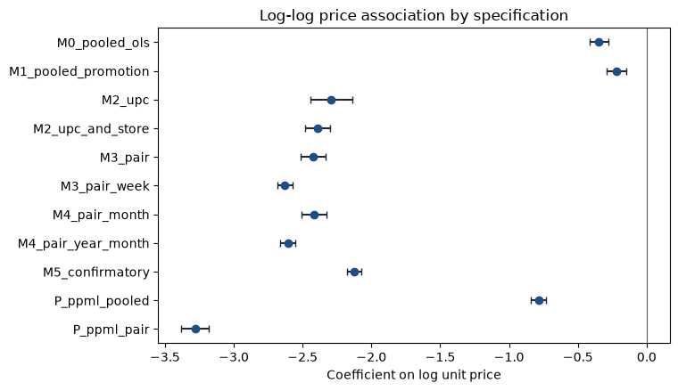
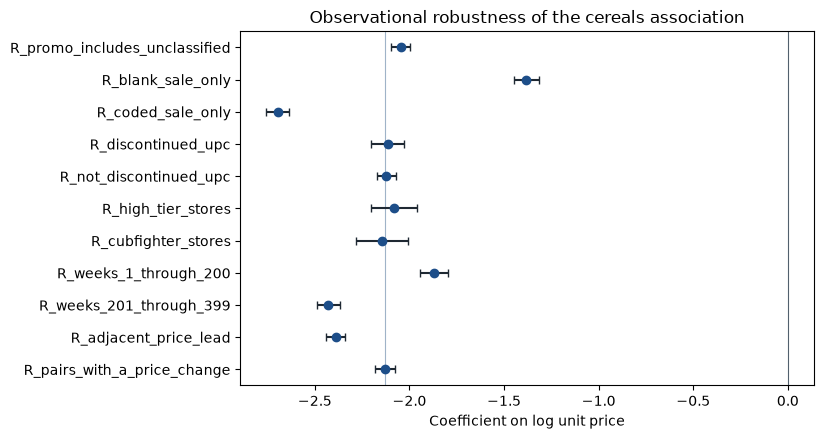
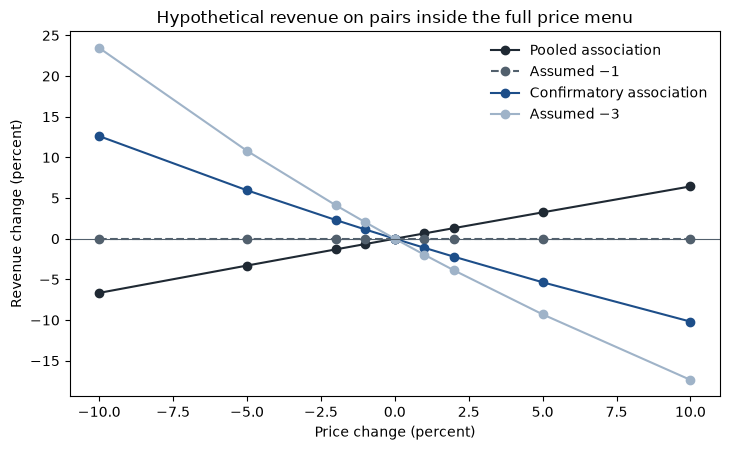
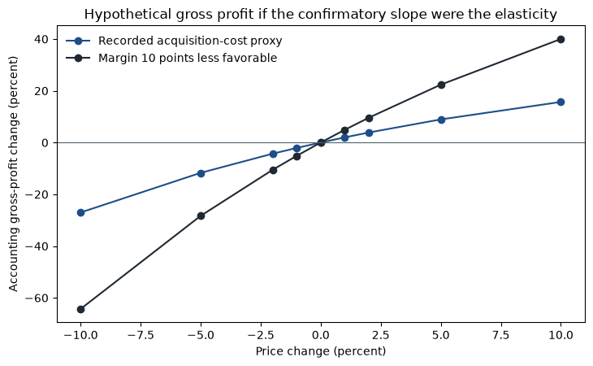

# Retail pricing under endogeneity

How does ready-to-eat cereal movement at Dominick's covary with unit price, and which pricing statements survive once price endogeneity is taken seriously?

Dashboard: https://retail-pricing-under-endogeneity.streamlit.app/

A shelf price and the week's sales are chosen together. A regression of movement on price therefore mixes demand with the chain's pricing rule. This project estimates that association on the Kilts Center cereals panel, audits the instruments that are often used to give it a causal reading, and stops when those instruments fail.

## Why it matters

A price cut can raise item movement and still reduce accounting gross profit, or the reverse. Those two outcomes are not the same decision. Treating an observational slope as a causal elasticity would pick one of them without evidence that the slope is the demand curve. The estimates below are associations. No price in this study was deployed.

## Dataset

Provider: James M. Kilts Center for Marketing, University of Chicago Booth School of Business.

Catalog: https://www.chicagobooth.edu/research/kilts/research-data/dominicks

Manual: Dominick's Data Manual, created July 2013, updated October 2018. Week 1 starts 14 September 1989. The cereals file runs through week 399, 7 May 1997.

The cereals movement zip and UPC file are the estimation inputs. Oatmeal is the named robustness category and has not been estimated. Canned soup was screened and set aside. Raw files are gitignored. Academic use requires acknowledgment of the Kilts Center. The series describes a defunct Chicago chain and is not current shopper behavior.

The audited cereals file has 6,602,582 rows. The log sample used for estimation has 4,707,776 UPC-store-weeks with a positive scanned sale, 93 stores, 489 UPCs, and 366 weeks. Recorded zeros are kept in the audited file and are not filled into the log sample.

## Methodology

Unit price is `PRICE / QTY` in dollars per item. The outcome is log item movement. The pre-specified confirmatory regression is

log(MOVE) = UPC-by-store effect + week effect + β log(unit price) + δ 1{SALE is B, C, or S} + error,

with standard errors clustered by store. The coefficient was not chosen by comparing R². Pooled OLS, coarser fixed effects, Poisson pseudo-maximum likelihood, and sample splits are sensitivities.

Average acquisition cost from the `PROFIT` field, lagged prices, other-store prices, price tier, the promotion flag, customer counts, demographics, a national cost index, and an exposure-weighted index were rejected as instruments before any correlation was used as evidence. Two-stage least squares was not estimated on scanner rows. `statsmodels` and `linearmodels` are declared in `pyproject.toml` and are not imported by the estimators. The slopes come from a within-transformed OLS checked against synthetic designs with known slopes.

## Main findings

The confirmatory price coefficient is **−2.128** (store-clustered standard error **0.026**). A 10 percent higher unit price is associated with about an **18.4 percent** lower item movement inside that specification. The store-clustered 95 percent interval is about **[−2.18, −2.08]**. Pooled OLS on the same rows is **−0.346**. That gap is a difference between two associations. It is not a measured bias correction.

The within-product association is about **−1.87** in weeks 1–200 and about **−2.43** afterward, and about **−1.38** on weeks with a blank promotion field versus **−2.70** on weeks with a coded promotion. Blank is not a verified regular price.

If −2.128 is used only as a hypothetical elasticity, a 10 percent price increase on the pairs whose own history contains every menu price lowers revenue by about **10 percent** and raises accounting gross profit by about **16 percent**. Both totals rise together only if the pooled association is treated as causal, which the identification audit rejected. Accounting gross profit uses average acquisition cost, not marginal cost. No scenario is supported for deployment.

## Figures



Store-clustered intervals for the log-price coefficient. M5 is the pre-specified association.



The same specification on promotion, calendar, and store-tier slices. These rows are not causal elasticities.





Hypothetical accounting. Revenue and accounting gross profit are separate series.

## Identification

Causal identification was not established. The public files do not contain the Hoch, Drèze, and Purk store assignments or the cereal weeks. Margin-derived cost is a function of the shelf price. The other candidates fail exclusion or have no within-store variation. A synthetic instrumental-variables example, with zero Kilts rows, recovers a known slope when exclusion holds and misses it when the instrument also shifts demand.

## Limitations

- The confirmatory coefficient is conditional on a positive sale, a pair effect, a week effect, and an incomplete promotion code.
- Week effects do not absorb a promotion that is specific to one UPC.
- A 10 percent increase from the last observed price is outside that pair's own price range for about 68 percent of pairs.
- Scenario dollars stack each pair's own last week. They are not one week of chain revenue.
- Substitution across cereals and competitor prices are not in the model.
- Oatmeal has not been estimated. Bertrand markups have not been estimated.

## Installation

Python 3.11 or newer. The machine used here was Python 3.13. The system `python3` on that machine was 3.9 and is not the project interpreter.

```bash
python3.13 -m venv .venv
source .venv/bin/activate
python -m pip install -e ".[dev]"
```

`pip install -e ".[dev]"` installs NumPy, pandas, SciPy, PyArrow, matplotlib, Streamlit, pytest, ruff, and also statsmodels, linearmodels, and seaborn. The last three are not imported by the estimators. A clean install of this set was run on 5 October 2026 and completed.

## Reproduction

From the project root, with the Kilts cereals files available:

```bash
python -m pricing_research.data.acquire --raw-dir data/raw --category cereals
python -m pricing_research.data.build
python -m pricing_research.reporting.explore
python -m pricing_research.estimation.run
python -m pricing_research.estimation.identify
python -m pricing_research.economics.counterfactual
python -m pytest
python -m ruff check src tests
```

`acquire` downloads a missing file with curl and otherwise checksums the local file. Do not commit `data/raw/`. The unit tests use synthetic rows and do not need the Kilts files. The command log for the clean-environment run is `reports/results/phase8_reproduction.log`. The audit of that run is `docs/phase8_audit.md`.

## Dashboard

Hosted app: https://retail-pricing-under-endogeneity.streamlit.app/

```bash
python -m streamlit run src/pricing_research/dashboard/app.py
```

The app reads the saved result files. It does not refit a model. Set `PRICING_DASHBOARD_SKIP_PANEL=1` to open the pages that do not need the log-sample parquet. Product-week charts use `data/processed/cereals_log_sample.parquet` when that file is present.

The public app is hosted on Streamlit Community Cloud from `src/pricing_research/dashboard/app.py` on branch `main`. `requirements.txt` is the dependency list that host installs. Product-week charts stay hidden there because the log-sample parquet is not in the repository.

## Reports

- Research paper: `reports/research_paper/paper.md`
- Executive memo: `reports/research_paper/executive_memo.md`
- Baseline memo: `reports/research_paper/baseline_findings.md`
- Identification audit: `reports/research_paper/identification_audit.md`
- Scenario memo: `reports/research_paper/pricing_scenarios.md`
- Interview notes: `docs/interview_preparation.md`
- Resume bullets: `docs/resume_bullets.md`
- Phase 8 audit: `docs/phase8_audit.md`

## Attribution

Scanner data: James M. Kilts Center for Marketing, University of Chicago Booth School of Business. Dominick's Dataset.

The Hoch, Drèze, and Purk everyday-price experiment is cited as their study. Their category sales and profit figures are not reestimated here.

Code and written analysis: Kritana Bastola. Repository: https://github.com/kritanabastola/Retail-Pricing-Under-Endogeneity. Raw Kilts files are not part of the result tables.
