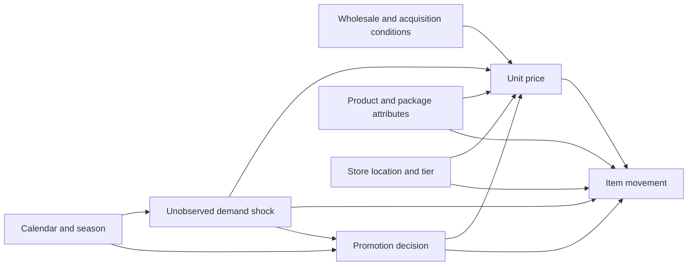

# Research design

## Question

How does retail demand respond to product price changes across stores and product categories, and under what assumptions can this relationship support defensible counterfactual pricing decisions?

The setting is historical scanner data from Dominick's Finer Foods, released by the Kilts Center. The primary category is ready-to-eat cereals. Oatmeal is the robustness category. Canned soup is deferred.

## What this project will estimate, in plain labels

| Piece | Label | Role |
| --- | --- | --- |
| Price and quantity distributions, missingness, promotion codes, tier and calendar variation | Descriptive | Shows where price variation actually is |
| Pooled OLS and the fixed-effects ladder on one pre-specified sample | Descriptive comparison | Shows how much of the OLS association is cross-sectional or common across time |
| UPC-by-store and week fixed effects, plus the incomplete `SALE` flag | Confirmatory conditional association | The pre-specified summary of within-series covariation |
| Splits by tier and by whether `SALE` is coded | Exploratory | Not a second confirmatory result |
| Instrument audit | Identification | Can end in "not identified" |
| Revenue and gross-profit scenarios | Accounting counterfactuals | Conditional on the association and on stated cost assumptions |

The specifications were written in `configs/specifications.yaml` before any coefficient was seen. The cereals baseline that was later fit is reported in `reports/research_paper/baseline_findings.md`. Seeing those coefficients did not change the confirmatory equation.

## Category choice

The choice uses counts from the public CSV files, profiled on 5 October 2026 by `python -m pricing_research.reporting.feasibility`. The machine-readable output is `reports/tables/category_feasibility.json`. These counts are file screens. They are not elasticities. The manual's printed observation totals match canned soup and do not match the cereals or oatmeal CSVs, so the table below uses the counted CSV rows.

| Screen | Cereals | Oatmeal | Canned soup |
| --- | ---: | ---: | ---: |
| CSV movement rows | 6,602,582 | 1,333,465 | 7,011,243 |
| Manual's printed row total | 6,417,055 | 1,301,870 | 7,011,243 |
| UPC attribute rows | 490 | 96 | 445 |
| Commodity codes | 311 only | 310 only | 324 (392) and 326 (53) |
| Stores | 93 | 93 | 93 |
| Same 93 store IDs in all three files | yes | yes | yes |
| Week index span | 1–399 | 91–399 | 1–399 |
| Distinct weeks present | 367 | 306 | 379 |
| Weeks missing inside that span | 32 | 3 | 20 |
| Duplicate UPC-store-week rows | 0 | 0 | 0 |
| Movement UPCs missing from the UPC file | 0 | 0 | 0 |
| `OK = 0` rows | 141,285 | 5,081 | 148,069 |
| `PRICE` exactly 0 | 1,851,380 | 352,202 | 1,459,559 |
| Negative `PRICE` | 0 | 0 | 0 |
| Positive `MOVE` with nonpositive `PRICE` | 677 | 58 | 1,085 |
| Log-sample rows (`OK=1`, price, qty, and move all positive) | 4,707,776 | 981,037 | 5,504,494 |
| Share of log-sample rows with `SALE` in {B, C, S} | 7.3% | 9.9% | 12.7% |
| Share of log-sample movement on those coded rows | 20.8% | 21.2% | 23.6% |
| UPC-store pairs in the log sample | 36,443 | 7,444 | 32,693 |
| Pairs whose truncated price changes | 85.5% | 85.9% | 95.7% |
| Pairs with at least two log-sample weeks whose peak-to-trough log unit-price range is at least log(1.05) | 82.7% | 82.2% | 94.8% |
| Median peak-to-trough log unit-price range, pairs with at least two weeks | 0.410 | 0.324 | 0.472 |
| Pairs where `PROFIT` changes and truncated `PRICE` does not | 5.3% | 3.8% | 1.8% |
| Pairs where `QTY` changes | 3.9% | 6.1% | 24.3% |
| Rows with `QTY` not equal to 1 | 5,034 | 586 | 50,991 |
| Median share of weeks observed inside a UPC's own first-to-last span | 0.920 | 0.990 | 0.950 |
| Median stores per UPC | 85 | 85 | 86 |
| Max/min monthly movement on the log sample | 1.43 | 2.90 | 3.01 |
| High and low months | January, June | January, July | November, July |
| `PRICE` or `PROFIT` differing from its hex double by more than 0.0001 | 0 | 0 | 0 |
| Undocumented `SALE` codes | G 11,075; L 1 | G 6,759 | G 2,111 |

The peak-to-trough range is the gap between the highest and lowest log unit price inside a UPC-store pair. It is not a typical week-to-week change and not an elasticity.

**Primary category: ready-to-eat cereals.** The file has 4.71 million rows that pass the pre-specified log screen, price changes inside 85.5 percent of UPC-store pairs, and only 5,034 rows with a bundle size other than 1. Monthly movement varies by a factor of 1.43, so seasonality is visible and milder than in the other two categories. All 490 attribute UPCs join, there are no duplicate keys, and the 93 store IDs match the other two files. Hoch, Drèze, and Purk (1994) included Cereal-RTE in the everyday-price experiment, which keeps that identification audit concrete. The cereals CSV has 32 missing week numbers, including 16 February 1995 through 16 August 1995. Those weeks stay missing.

**Secondary category: oatmeal.** It has 981,037 log-sample rows, price variation in 85.9 percent of pairs, and a 7.7 MB zip. It is the manual's hot-cereal category, starts at week 91 (6 June 1991), and is more seasonal than ready-to-eat cereal (monthly movement factor 2.90). That is a useful robustness check because it is a related breakfast good with a different calendar and a smaller file.

**Canned soup is feasible and is not the robustness category.** It has the largest log sample and the most within-pair price variation. It also has the manual's bundle problem in measurable form: `QTY` changes inside 24.3 percent of pairs. It has two commodity codes, stronger winter seasonality (November movement is about three times July), and more missing-week patches. Those are reasons to hold it for a later bundle-quantity stress test, not reasons to doubt that the file can be read.

Inside each category, other UPCs are the observed substitutes. No rival-chain price file is in the Kilts downloads checked here. Competitive price audits mentioned by Hoch, Drèze, and Purk are not part of these files.

## Unit of observation and measures

The row is a UPC-store-week that exists in the movement file. Combinations that were never written to the file are not filled with zero. Zero-filling would treat assortment gaps, stockouts, and unrecorded weeks as true zero demand. The manual does not say that.

Quantity is `MOVE`, in items. The price regressor is log(`PRICE / QTY`), the log of the per-item bundle price. Package size stays in the UPC description. With UPC fixed effects, a time-invariant package size is absorbed. A per-ounce price is exploratory because `SIZE` is an irregular string.

Revenue and accounting gross profit use the manual's identities. They are outcomes for later counterfactuals, not the confirmatory dependent variable. The confirmatory dependent variable is log item movement, which is defined only when movement is positive. The count of zero-movement rows, and of `OK = 0` rows, will be reported before those rows are left out of the log sample. Leaving them out is a selected sample of positive scanned sales. It is not a stockout model.

## Hypotheses

These are stated before any demand regression. A result that rejects them is a result.

1. On the cereals log sample, the confirmatory coefficient on log unit price is negative. Item movement is lower when the unit price is higher, after UPC-by-store and week fixed effects and the incomplete promotion indicator. A zero or positive estimate will be reported. It will not be searched away.
2. On that same sample, the pooled OLS price coefficient differs from the confirmatory fixed-effects coefficient. The comparison is two-sided. The specification that looks more precise is not the one that gets reported as preferred.
3. The same confirmatory specification on oatmeal produces a price coefficient with the same sign as the cereals coefficient. A sign disagreement is a robustness finding. It is not a reason to drop oatmeal.

A fourth statement is a decision rule rather than a hypothesis: no instrumental-variables estimator is causal in this project unless an assignment mechanism and an exclusion argument are written down before the second stage is inspected. That bar is not met. See `docs/identification.md`.

## Unit of observation, parameters, and bias

The row is a UPC-store-week that exists in the movement file. The target associational parameter is β in the confirmatory equation: the difference in log item movement associated with a difference in log unit price, after UPC-by-store effects, week effects, and a coded-promotion indicator. The causal parameter of interest, which is not claimed, is the effect of an exogenous unit-price change on item movement for a cereal UPC in a Dominick's store-week.

| Object | Definition |
| --- | --- |
| Outcome in the confirmatory regression | `log(MOVE)`, items, on the log sample |
| Accounting outcomes, later and separate | Revenue `PRICE * MOVE / QTY`; gross profit `revenue * PROFIT / 100` |
| Explanatory variable | `log(PRICE / QTY)` |
| Promotion control | `1{SALE in {B,C,S}}`. Blank is not a confirmed regular-price week. `G` and `L` are unclassified. |
| Confounders the fixed effects absorb | Time-invariant UPC-store factors, including package size and the 1990 demographic profile; shocks common to all cereals in a week, including a common holiday |
| Confounders they do not absorb | UPC-specific promotions, local demand shocks, costs that move the shelf price, and stockouts recorded as a zero price |
| Selection | The log sample drops `OK=0`, nonpositive movement, and nonpositive price. In cereals that removes 141,285 suspect rows, about 1.85 million zero-price rows that almost all have zero movement, and 677 rows with positive movement and a zero price. Missing week numbers are not filled in. |

External validity stops at this chain, these categories, and 1989–1997. Dominick's was a high-low Chicago grocer. The estimates are not current national elasticities, not a store-choice model, and not a statement about rival chains.

## Conceptual DAG

This is a sketch of plausible relationships. It is not evidence, and it is not identified by the fixed-effects regression.

The arrow from the demand shock into price is the endogeneity problem. The arrow from price into movement is the association the regression tries to describe. Promotion points at both price and movement, so a promotion coefficient is not a pure price effect. Costs point at price. Average acquisition cost, as recorded through `PROFIT`, also depends on past wholesale purchases and on the retail price, so it is not a clean arrow into price from outside the system.

## Original extension

The extension beyond a single demand regression is a decision analysis under unresolved endogeneity.

1. An identification audit with an explicit stopping rule: if no candidate instrument meets a written relevance and exclusion argument, the paper says identification was not established. That audit is complete. The conclusion is that identification was not established. The memo is `reports/research_paper/identification_audit.md`.
2. A comparison of price changes in weeks where `SALE` is coded and weeks where it is blank, with the blank group labeled as incompletely measured rather than as a pure regular-price sample.
3. Accounting counterfactuals that carry the fixed-effects estimate, a more price-sensitive adverse case, and a less favorable margin, and that refuse price changes outside the historical within-UPC-store support.

Using several Python libraries is not the contribution.

## What a recruiting economist should be able to ask

The design is meant to survive these questions.

- What variation identifies the preferred coefficient after the fixed effects?
- Why are chainwide promotions not absorbed by week fixed effects, and why are UPC-by-week effects not in the preferred model?
- Why is average acquisition cost not an instrument?
- Where is the randomization file for the 1994 experiment?
- What would a negative, zero, or positive price coefficient mean economically, including the inelastic case in which a small price increase raises revenue?
- Which statements are descriptive, which are conditional associations, and which are simulations?

The identification answers are in `docs/identification.md`. File counts are in `reports/tables/category_feasibility.json`. Fitted cereals associations, which are not causal elasticities, are in `reports/research_paper/baseline_findings.md`.
