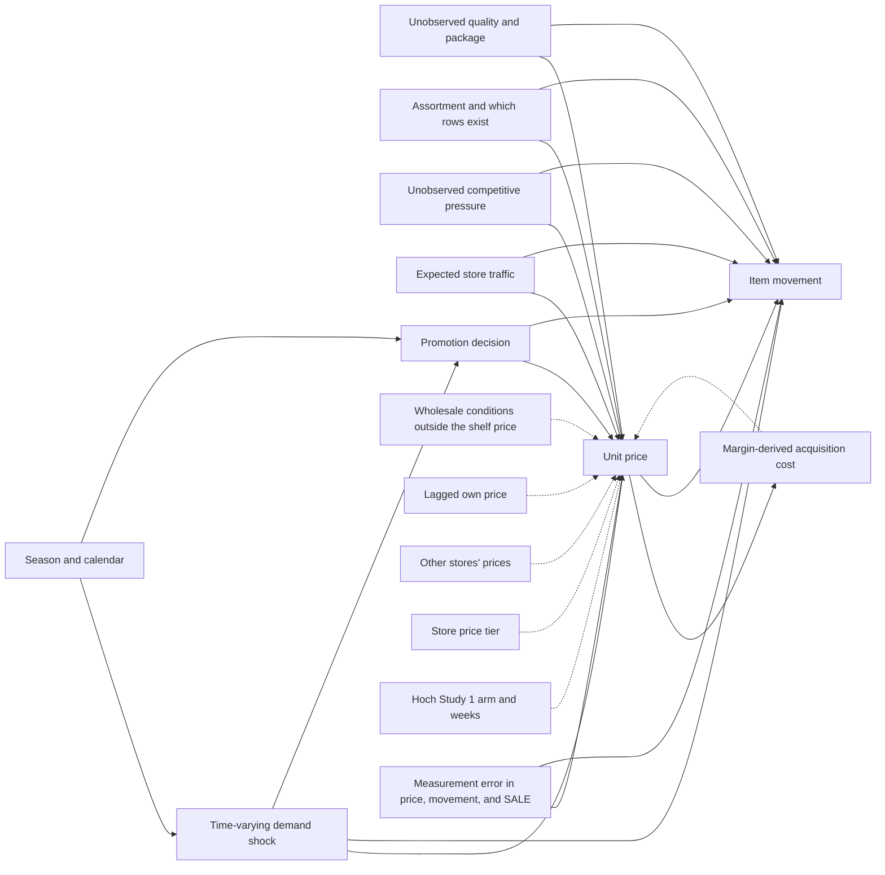

# Cereals identification audit

Command: `python -m pricing_research.estimation.identify`.

Branch: **B. Identification is inadequate.** No causal price elasticity is claimed. Two-stage least squares was not estimated on any Kilts row. The retained observational result is the pre-specified confirmatory association, model `M5_confirmatory`: log item movement on log unit price, with UPC-by-store effects, week effects, and the incomplete B/C/S promotion indicator, standard errors clustered by store. On the cereals log sample that coefficient is −2.128 (store-clustered SE 0.026). Full precision is in `reports/results/baseline_models.json`.

The log sample is unchanged: 4,707,776 rows, hash `023bd0b03df848a782b8bfab3b2ddce418543b08202736047ea418f923b4b4fb`. Instrument verdicts were fixed in `src/pricing_research/estimation/instruments.py` before the correlations below were computed. A correlation cannot approve an instrument. The audit command raises if any verdict is `APPROVED`.

Machine-readable outputs:

- `reports/results/identification_audit.json`
- `reports/tables/instrument_evidence.csv`
- `reports/tables/identification_robustness.csv`
- `reports/figures/identification_01_robustness.png`
- `reports/results/synthetic_iv_demonstration.json` (synthetic rows only; `kilts_rows` is 0)

## What would have to be true for a causal elasticity

The parameter of interest is the effect of an exogenous change in a cereal UPC's unit price on that UPC's item movement in a Dominick's store-week. The confirmatory regression describes a partial association in the scanned log sample. It becomes that causal parameter only under an assumption this audit does not adopt: that the price changes left inside a UPC-store pair, after week effects and the coded promotion flag, are independent of the demand shocks left in the residual.

## Task A — Sources of possible bias

These are open paths from unobserved conditions into both the shelf price and scanned movement. They are reasons the observational slope can differ from a causal elasticity. They do not, by themselves, sign that difference. Signing it would require a restriction on which path dominates and on how the chain sets prices. This audit does not impose that restriction. The gap between pooled OLS (−0.346) and the confirmatory slope (−2.128) is a gap between two associations. Reading it as the sign of omitted-variable bias would require the fixed-effects slope to be the causal parameter. That reading is not used.

| Source | How it can enter both price and movement |
| --- | --- |
| Simultaneity | The chain sets the shelf price with demand in view, and scanned movement is the quantity that clears at that price. |
| Product-specific unobserved quality | Taste, brand, and package attributes shift willingness to pay and the regular price. Pair effects remove attributes that are constant inside a UPC-store pair. They leave attributes that change, and they leave the chain's response to quality it observes and the scanner file does not. |
| Promotions selected in response to demand | A deal is a price and a merchandising action. The B/C/S flag is an incomplete record of that action. Blank is not a confirmed regular-price week. Codes `G` and `L` are unclassified and sit in the confirmatory reference group. |
| Expected store traffic | A week the chain expects to be busy can be a week it promotes. Traffic is an outcome of prices as well as a shifter of category movement. |
| Assortment | Which UPCs are carried, and which rows exist in the file, is a chain decision. The log sample keeps positive scanned movement only. |
| Unobserved competitive pressure | Zone tiers line up with location and with Cub Foods competition. Rival prices are not in the files. A response to a rival can move Dominick's price and Dominick's movement together. |
| Seasonality and time-varying demand shocks | Holidays, weather, and local media move many stores in one week. Additive week effects remove a shock common to all cereals that week. They leave a shock specific to one UPC, including a chainwide promotion of that UPC. |
| Measurement error | `PRICE` is a truncated shelf price. `MOVE` is scanned sales, not an order at a posted price when the item is absent. `PROFIT` is an average-acquisition-cost margin in percent of sales. `SALE` does not cover every promotion. |

Fixed effects change which price variation remains. They do not make the remaining variation exogenous. Store-clustered standard errors are an inference choice. Clustering is not an exogeneity proof.

### Causal DAG

The arrows are a list of relationships the design has to take seriously. They are not estimated, and a missing arrow is not a finding. Dashed arrows are candidates this audit rejects as instruments. A rejected candidate can still be correlated with price.

The solid arrow from unit price to item movement is the causal effect the project would like and does not claim. The arrows from the demand shock, promotions, traffic, quality, assortment, and competition into price are the endogeneity problem. Week effects block the part of season and of the common shock that is shared by every cereal in the week. Pair effects block quality, tier, demographics, and competition that are constant inside the UPC-store pair. Chainwide UPC promotions, uncoded promotions, and expected demand for that UPC remain.

Average acquisition cost, as constructed from `PRICE` and `PROFIT`, has an arrow back from the shelf price. That is why a wholesale-cost story does not automatically satisfy exclusion. A national weekly cost index is not in the files. If it were a pure time series, week effects would absorb it. An exposure interaction would need its own exposure measure and its own exclusion argument. Neither is in the confirmatory design.

## Task B — Instrument evidence

Every candidate is **REJECTED**. Correlations below are descriptive. They are not a first stage, and they were not used to choose the verdict.

| Variable | Verdict | Correlation with log unit price | Within-pair correlation | Share of its variation left after pair and week effects | Missing share |
| --- | --- | --- | --- | --- | --- |
| `hoch_dreze_purk_study1_assignment` | REJECTED | Not constructed | — | — | The assignment is absent |
| `log_average_acquisition_cost` | REJECTED | 0.886 | 0.613 | 0.137 | 0 on the log sample |
| `lagged_log_unit_price` | REJECTED | 0.928 | 0.551 | 0.114 | 0.042 (adjacent week missing) |
| `other_store_leave_one_out_log_unit_price` | REJECTED | 0.990 | 0.956 | 0.104 | 0.00046 |
| `price_tier` | REJECTED | 0.087 point-biserial, High vs CubFighter | None inside a pair | 0, because tier is constant within every store | 0.016 of rows have a null tier |
| `promo_coded` | REJECTED as an instrument | −0.210 | −0.374 | 0.892 | 0 |
| `customer_counts` | REJECTED | Not constructed | — | — | File sized in Phase 1 and not opened |
| `demographics_1990` | REJECTED | Not constructed | — | — | One 1990 cross-section, not opened |
| `national_cost_index` | REJECTED | Not joined | — | A week-constant demonstration series has remaining share 0 after week effects | No series on file |
| `exposure_weighted_cost_index` | REJECTED | Not constructed | — | — | No exposure measure on file |

Full prose for each row is in `reports/tables/instrument_evidence.csv`. The economic content is below.

### Hoch, Drèze, and Purk Study 1 assignment

Source: Hoch, Drèze, and Purk (1994), *Journal of Marketing* 58(4). Cereal-RTE is in their Table 1 at a 10 percent everyday price change. Construction: not built. The raw directory listing in the audit JSON contains no assignment filename. Economic rationale: category-by-category random assignment to EDLP, Hi-Lo, or control would shift everyday prices. Variation: store by category, for a limited run of weeks, if the design was implemented as described. Correlation with price: not computed, because the arm is not on file. Exclusion: usable only after the arm and the cereal weeks are known and checked against prices. Direct effects and common shocks: promotional prices were supposed to be the same dollar price across arms, and the stores share a media market, holidays, and competitors. Required controls: the assignment and the weeks, written down before any second stage. Sensitivity to fixed effects: store-by-week effects would absorb a category-wide experimental shift, which is why those effects were kept out of the confirmatory equation. Missingness: complete, in the sense that the file is absent. **REJECTED.** A teaching-note date and a later mixture label are not the randomization. Mining a price pattern and calling it the experiment would be a different study.

### Log average acquisition cost

Source: the same movement row, `PRICE`, `QTY`, and `PROFIT`. Construction: `log(unit price × (1 − PROFIT/100))` when that product is positive. Rationale: a wholesale cost can shift retail price when the cost is not computed from the retail price. Variation: the series moves when the margin or the shelf price moves. It is highly correlated with log unit price in the cross-section (0.886) and inside pairs (0.613). About 14 percent of its variation remains after pair and week effects. Exclusion fails because `PROFIT` is a margin in percent of sales, so the product puts the shelf price back into the proposed instrument. When the margin is constant the correlation with log price is 1 by algebra; the unit test checks that identity. Direct effects: forward buying ties wholesale deals to retail promotions. Common shocks: manufacturer deals are often chainwide. Required control that is missing: a cost that is not a function of the shelf price. Fixed effects do not remove a mechanical function of price. Missingness on the log sample: none of the constructed values failed the positive-cost screen. **REJECTED.** A first-stage F statistic would not repair the exclusion failure. Gross margin is not transformed into an instrument.

### Lagged log unit price

Source: the same UPC-store series. Construction: log unit price in the previous calendar week, and only when that adjacent log-sample week exists. Gaps are not filled. Rationale: the lag is predetermined on the calendar. Variation: within the pair, one week earlier. Correlation with current log price is 0.928, and 0.551 inside the pair. About 11 percent of the lag's variation remains after pair and week effects. Missingness is 4.2 percent (4,509,599 of 4,707,776 rows have an adjacent prior week). Exclusion fails because predetermined is not exogenous when promotions and demand shocks persist. A multi-week deal enters the lag and current movement. Pair and week effects do not create an exclusion restriction. **REJECTED.**

### Other stores' leave-one-out log unit price

Source: other stores in the same UPC-week, requiring at least two stores. Construction: the leave-one-out mean. Rationale: a Hausman instrument needs a common cost and demand shocks that are independent across markets. Variation: across stores in the week, and over weeks. Correlation with own log price is 0.990, and 0.956 inside the pair. About 10 percent of this series remains after pair and week effects, which is the part that is not a common week shock and not the pair's average. Exclusion fails because Dominick's is one chain in one city. Promoted prices were supposed to be chainwide, so another store's price is often the same promotion. Weather, holidays, and local media are common shocks. Week effects do not remove a UPC-specific chainwide price. Missingness is 0.046 percent. **REJECTED.**

### Price tier

Source: the store codebook, a 1992 snapshot. Construction: the store's tier, joined on store id. The correlation reported is the point-biserial correlation of a High-tier indicator with log price on High and CubFighter rows only (1,874,822 rows): 0.087. Within a pair the tier does not vary, so there is no within-pair correlation. The remaining share after pair effects is 0 because tier is constant within every store. Missingness: 1.6 percent of log-sample rows have a null tier. Exclusion fails because tier is the chain's zone policy, lined up with location and with Cub Foods competition. **REJECTED** as an instrument. The High and CubFighter subsample slopes below are exploratory descriptions of the observational association. They are not a tier instrument.

### Coded promotion flag

Source: `SALE`. Construction: `1{SALE in {B, C, S}}`. `G` and `L` stay unclassified in the confirmatory equation. Correlation with log price is −0.210, and −0.374 inside the pair. About 89 percent of the flag's variation remains after pair and week effects, so week effects do not absorb it. Missingness: 0. The flag is a merchandising choice. The manual does not describe it as randomized. Features and coupons can raise movement at a given shelf price, which is why the confirmatory equation uses the flag as a control. **REJECTED** as an instrument.

### Customer counts and 1990 demographics

Customer counts are a daily store-traffic file. It was sized in Phase 1 and not opened. Traffic responds to deals, so it is an outcome of price. Demographics are one 1990 cross-section, also not opened. Pair effects would absorb them, and they do not shift weekly price. **REJECTED.** Opening either file would not supply an exclusion restriction.

### National cost index and an exposure-weighted index

No wholesale invoice, replacement cost, or national input-cost series was joined. A pure weekly index is a common shock. The audit demonstrates the absorption with the week number itself: that series is constant inside a week, and its remaining sum-of-squares share after week effects is 0. That demonstration is not a Kilts cost. An exposure-weighted index was not built. Package mix and ingredient shares enter demand directly, and a time-invariant exposure is absorbed by pair effects. **REJECTED.** A wholesale input cost does not automatically satisfy exclusion, and multiplying a national index by an exposure requires a defensible exposure of its own.

## Task C — Branch B

No candidate met a written exclusion argument that survives the files in hand. The Hoch design is real in the journal and unusable here. The audit therefore does not report a first stage, a reduced form, a structural IV equation, a rank condition, a weak-instrument diagnostic, a weak-instrument-robust confidence set, or an overidentification statistic for the scanner sample. Those objects are **not applicable**. The absence is the decision not to estimate 2SLS. It is not a hidden weak first stage.

A Hausman or Durbin–Wu–Hausman test was not computed. That test needs one estimator to be consistent for a causal parameter. No such estimator was established.

`linearmodels` was not imported. The observational fits reuse the within-transformed OLS from the baseline, with store-clustered standard errors and a Student t reference on G − 1 degrees of freedom.

### Retained observational result

`M5_confirmatory` stays the confirmatory association. The robustness fits below do not replace it. Each uses the same log sample rules. Each recomputes the within-pair price-change screen. The 20 percent floor is cleared in every fit below (the lowest share is 0.810, on blank `SALE` rows). Coefficients are store-clustered. A 10 percent translation is `exp(β log 1.10) − 1` applied to the fitted association.

| Specification | Rows | Stores | Price coefficient | Store SE | 95 percent interval | Associated movement at a 10 percent higher price |
| --- | --- | --- | --- | --- | --- | --- |
| M5 confirmatory, retained | 4,707,776 | 93 | −2.128 | 0.026 | [−2.179, −2.076] | −18.4% |
| G and L moved into the promotion indicator | 4,707,776 | 93 | −2.046 | 0.026 | [−2.097, −1.995] | −17.7% |
| Blank `SALE` only | 4,350,772 | 93 | −1.383 | 0.033 | [−1.450, −1.317] | −12.4% |
| Coded B/C/S only | 345,945 | 93 | −2.696 | 0.030 | [−2.755, −2.637] | −22.7% |
| Discontinued UPCs (`descrip` begins with `~`) | 257,674 | 93 | −2.116 | 0.043 | [−2.201, −2.031] | −18.3% |
| UPCs without that mark | 4,450,102 | 93 | −2.121 | 0.026 | [−2.173, −2.069] | −18.3% |
| High-tier stores | 1,357,188 | 25 | −2.082 | 0.059 | [−2.205, −1.960] | −18.0% |
| CubFighter stores | 517,634 | 9 | −2.145 | 0.059 | [−2.280, −2.010] | −18.5% |
| Weeks 1–200, ending 14 July 1993 | 2,528,421 | 86 | −1.870 | 0.036 | [−1.943, −1.798] | −16.3% |
| Weeks 201–399, starting 15 July 1993 | 2,179,355 | 93 | −2.428 | 0.030 | [−2.488, −2.368] | −20.7% |
| M5 plus the next calendar week's log price | 4,509,599 | 93 | −2.389 | 0.025 | [−2.439, −2.340] | −20.4% |
| Pairs whose unit price changes by more than $0.001 | 4,634,526 | 93 | −2.128 | 0.026 | [−2.180, −2.077] | −18.4% |

The week split was fixed at week 200, the midpoint of manual weeks 1–399, before these subsample coefficients were computed. The late window contains the missing weeks 262–265, 284–309, and 370–371.

### How to read the sensitivities

Moving `G` and `L` into the promotion indicator changes the price coefficient from −2.128 to −2.046. The sign does not flip. Both versions are reported. The promotion coefficient in that recode is 0.480 (SE 0.005), against 0.450 in M5. The flag remains an incomplete control.

Blank rows and coded rows answer different descriptive questions. On blank rows the slope is −1.383. On coded B/C/S rows it is −2.696. Blank is still not a confirmed regular-price state. The gap is large enough that a single elasticity is a poor summary of the two slices. Both slices stay negative, and both store-clustered intervals lie below −1. That is a property of these associations.

Discontinued and continuing UPCs agree at about −2.12. Restricting to pairs with a unit-price change above $0.001 reproduces M5 at −2.128. The pairs that never move the shelf price are not what identifies the within-pair slope.

High-tier stores (25) and CubFighter stores (9) have point estimates close to M5. Both are flagged because the cluster count is below 30. The intervals use a t reference with G − 1 degrees of freedom, so the CubFighter interval is already the small-G interval. Nine clusters still make that interval a rough description of store-level dependence. These splits are exploratory robustness. They are not the later confirmatory heterogeneity exercise, and oatmeal was not estimated.

The first half of the calendar (weeks 1–200, 86 stores) gives −1.870. The second half gives −2.428. Both intervals lie below −1 and exclude each other's point estimate. The magnitude of the association is not stable across this pre-specified split. A constant elasticity is a strong extra assumption on top of the identification problem.

The adjacent-lead specification adds next week's log price when the next calendar week is present and belongs to the same pair. The lead coefficient is 0.459 (SE 0.010). The contemporaneous price coefficient moves to −2.389. A nonzero lead rejects the narrow story that, after the confirmatory controls, movement is related only to the current price. It does not prove that the current price is exogenous, and it does not sign the bias in the confirmatory slope. A zero lead would not have proved exogeneity either. The lead uses 4,509,599 rows. Gaps are not filled.

Influential rows were already checked in the baseline. Dropping the 4,708 rows above the 99.9 percentile of Cook's distance, as a diagnostic only, moves M5 from −2.128 to −2.118. That diagnostic sample is not a new specification and was not refit here.

### Scenario arithmetic

These are calculations under an assumed constant elasticity. They are not causal effects, and they are not prices the chain is advised to charge. Movement change at a 10 percent higher price is `exp(β log 1.10) − 1`. Revenue change, if quantity scaled by that factor and nothing else changed, is `1.10^(1+β) − 1`. At β = −1 the revenue change is 0. Of 35,878 multiweek pairs, 27,893 (77.7 percent) have a historical log-price range at least as wide as log(1.10). That share says a 10 percent move sits inside many historical ranges. It does not say a uniform 10 percent increase is a feasible counterfactual for every pair. Full accounting counterfactuals are a later phase and were not run.

| Scenario | Assumed elasticity | Associated movement change | Revenue change if quantity scales that way |
| --- | --- | --- | --- |
| Observational confirmatory association | −2.128 | −18.4% | −10.2% |
| Observational pooled association | −0.346 | −3.2% | +6.4% |
| Assumed unit elasticity | −1 | −9.1% | 0 |
| Assumed steeper elasticity | −3 | −24.9% | −17.4% |

The pooled and confirmatory rows use the fitted associations as the assumed numbers. Using either one as a causal elasticity is an extra assumption. The unit and the steeper rows are round assumptions. The steeper row is near the pair-effect PPML neighborhood from the baseline and is not that PPML estimate imported as a causal parameter.

### Synthetic 2SLS demonstration

`reports/results/synthetic_iv_demonstration.json` is a separate example. It uses 20,000 draws from seed 20261005. It uses zero Kilts rows. `empirical` is false.

| Design | True price coefficient | 2SLS estimate | First-stage coefficient | Direct effect of the instrument on the outcome | Recovers the price coefficient |
| --- | --- | --- | --- | --- | --- |
| Excluded instrument | −1.4 | −1.404 | 0.806 | 0 | Yes |
| Instrument also shifts the outcome | −1.4 | −0.652 | 1.200 | 0.9 | No |

The second design has a strong first stage and the wrong price coefficient. That is the exclusion failure in miniature. It is not a result about Dominick's.

## Task D — What the estimates identify

The confirmatory coefficient identifies the partial association between log unit price and log item movement in the cereals log sample after UPC-by-store effects, week effects, and the B/C/S indicator, together with store-clustered sampling uncertainty for that association.

It does not identify the effect of an exogenous price change. It does not identify the Hoch–Drèze–Purk treatment effect. It does not identify a marginal-cost curve, a profit-maximizing price, or a revenue change that would have been realized. The model results do not imply cause and effect.

The scenario table is conditional arithmetic under a stated elasticity. It is not a causal counterfactual and not a description of a price the chain posted as a policy. The historical range share is a descriptive fact about observed prices.

The most serious unresolved threat is the price variation the confirmatory slope actually uses. Inside a UPC-store pair, after a common cereal-week shock and an incomplete promotion flag, the remaining price changes are still chosen. Chainwide promotions of one UPC survive week effects. Uncoded promotions sit in the reference group. Expected demand for that UPC can move the shelf price and the scan in the same week. The nonzero price lead is one observable sign that nearby prices and current movement are tied together. It is not a measurement of the bias.

Identification would improve if the Study 1 assignment and the cereal weeks were obtained and checked against observed prices before any second stage. A wholesale cost that is not a function of the shelf price could be examined only with its own exclusion argument; a national weekly index would still be absorbed by week effects unless a defensible, excluded exposure were observed. Separate markets would be required before other-store prices could be reconsidered. This file is one chain in one city and does not provide them.

## Statistical and identification checks

- Verdicts are `REJECTED` in code. The audit raises if any verdict is `APPROVED`. None was.
- 2SLS on scanner rows is false in the audit JSON. Weak-instrument diagnostics and the overidentification test are recorded as not applicable.
- The endogeneity test was not run, for the reason above.
- Store clustering is the reported uncertainty. High-tier (25 stores) and CubFighter (9 stores) intervals are flagged as few-cluster. Week-clustered and two-way standard errors for M5 were already reported in the baseline memo (0.052 and 0.058) and still left that interval below −1. Those larger standard errors describe dependence. They do not validate an instrument.
- The unit tests in `tests/unit/test_identification.py` check that no candidate is approved, that a valid synthetic instrument recovers −1.4 and an invalid one does not, that a week-level series is absorbed by week effects, that a constant-margin log cost correlates exactly with log price, that unit elasticity implies a zero revenue change, and that a lead or lag skips a one-week gap.
